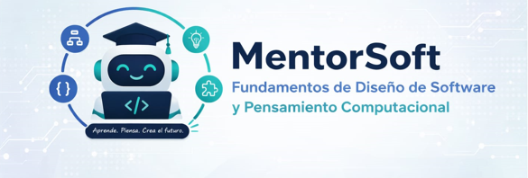

# ITMentorSoft Frontend

## Descripción del proyecto

Este proyecto tiene como objetivo principal potenciar el dominio de los fundamentos de desarrollo de software y las habilidades de pensamiento computacional en estudiantes que ingresan a programas de ingeniería de software, mediante el diseño e implementación de un tutor inteligente con capacidades de diagnóstico adaptativo y generación de rutas de aprendizaje personalizadas.

## Stack tecnológico

- Angular
- TypeScript
